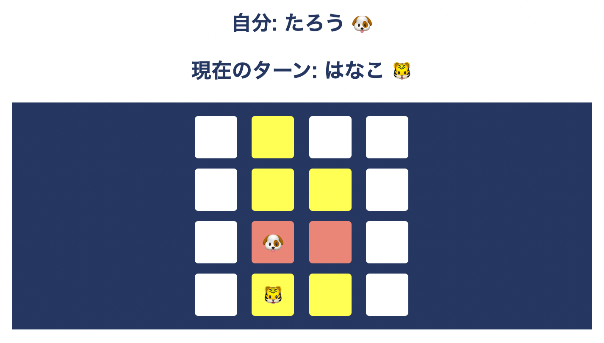

# 概要
2~4人用オンライン対戦ゲーム「crackpanel」です。ブラウザ上で遊べるためインストールの必要がなく、オンライン飲み会の際など、すぐに遊ぶことができます。

使用言語はHTML、CSS、JavaScriptで、FirebaseのFirestore Databaseでデータの管理をしています。

 

# デモ
https://crackpanel-3413c.web.app/

    

    

